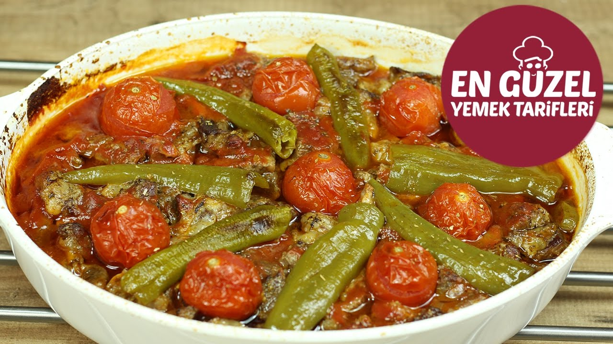
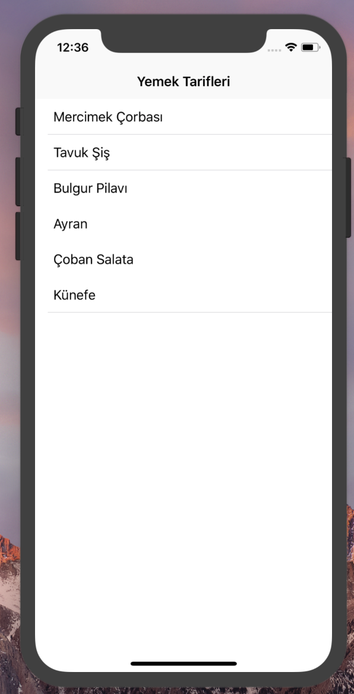
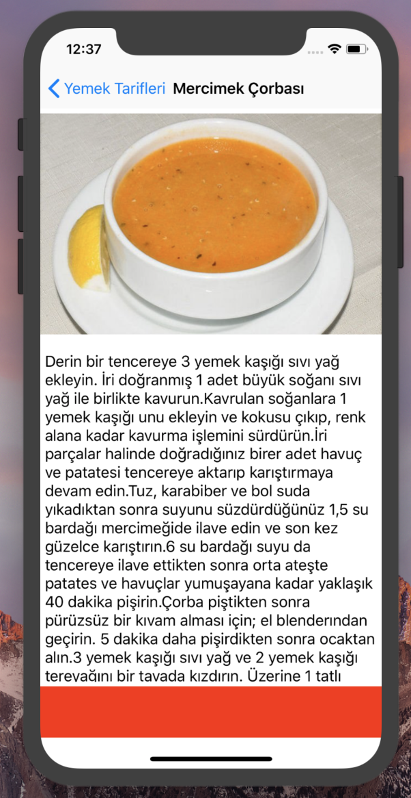
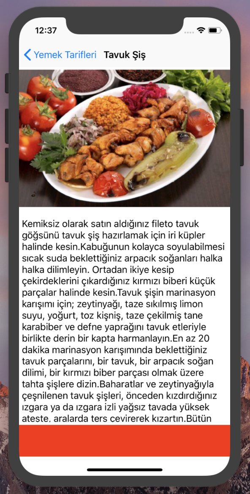
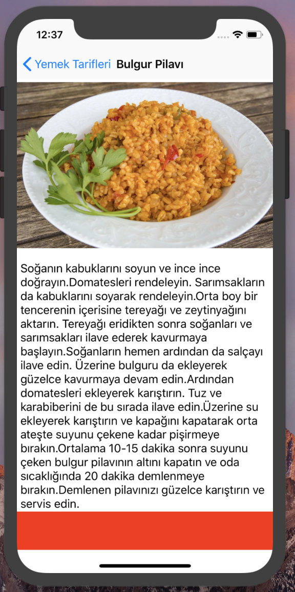
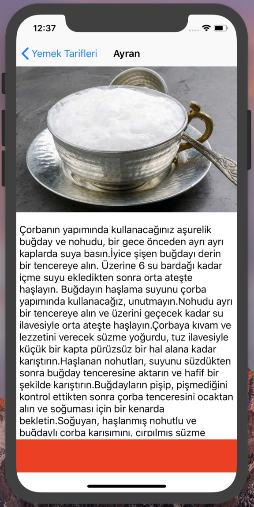
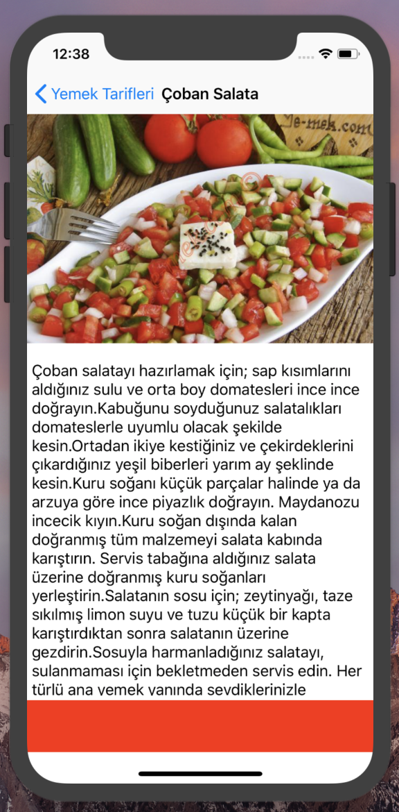

# Recipes App 👩🏻‍🍳 🥘

## The goal of the project 👀

Recipes is an iOS application developed with Swift-4. The aim is to provide the user with the frequently used iOS applications.
It is to demonstrate the use of the Table View structure. You can learn many methods about Table View and use it in your own projects.
I aim to use these structures.

## Content of the Project
It is an iOS project developed with Swift-4. You will learn how to use components such as TableView, Navigation.  

## Screenshots of the Project 📱

### List elements found in Table View 📜

  

### Contents of the elements in the list

  

   
